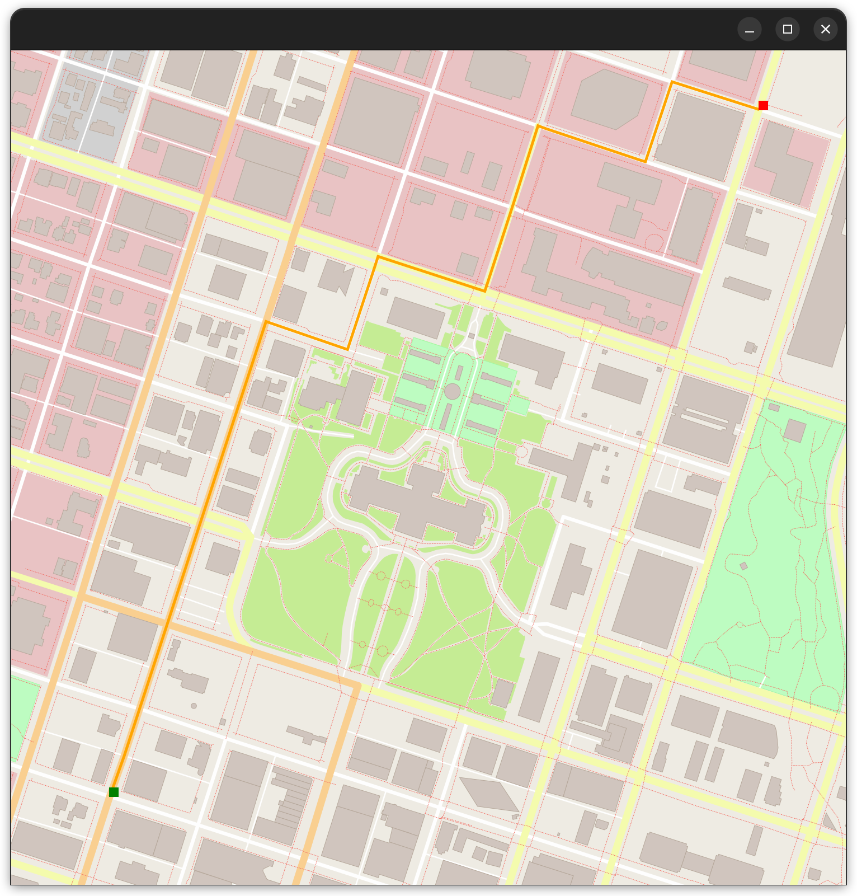

# Route Planning Project

This repo contains the final code for the Route Planning project.




## Install Dependencies and Tools for Running Locally on Linux

```
sudo apt update && sudo apt upgrade 
sudo apt install build-essential
```

Git:

```
sudo apt install git 
```

GNU debugger:

```
sudo apt install gdb
```

cmake:

```
sudo apt install cmake 
```

Cairo: 

```
sudo apt install libcairo2-dev 
```

graphicsmagick:

```
sudo apt install libgraphicsmagick1-dev 
```
 
libpng:  

```
sudo apt install libpng-dev 
```
 
IO2D (graphics):
 
```
git clone --recurse-submodules https://github.com/cpp-io2d/P0267_RefImpl 
cd P0267_RefImpl 
mkdir Debug 
cd Debug 
cmake DCMAKE_BUILD_TYPE=Debug .. 
cmake --build . 
sudo make install
```

## Cloning

When cloning this project, be sure to use the `--recurse-submodules` flag. Using HTTPS:
```
git clone https://github.com/SonyaJane/CppND-Route-Planning-Project.git --recurse-submodules
```
or with SSH:
```
git clone git@github.com:SonyaJane/CppND-Route-Planning-Project.git --recurse-submodules
```

## Compiling and Running

### Compiling
To compile the project, first, create a `build` directory and change to that directory:
```
mkdir build && cd build
```
From within the `build` directory, then run `cmake` and `make` as follows:
```
cmake ..
make
```
### Running
The executable will be placed in the `build` directory. From within `build`, you can run the project as follows:
```
./OSM_A_star_search
```
Or to specify a map file:
```
./OSM_A_star_search -f ../<your_osm_file.osm>
```

## Testing

The testing executable is also placed in the `build` directory. From within `build`, you can run the unit tests as follows:
```
./test
```  
